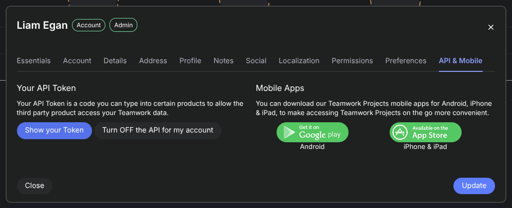

# wtctw

> Trying to make using Teamwork better for developers, since 2026.

A terminal CLI for [Teamwork.com](https://teamwork.com) — view today's tasks, manage timers, post comments, and hand tasks back, all without touching the browser.

---

## Roadmap

1. Adding in board controls - need to determine the best way to accomplish this, both in terms of actual usage and in terms of the teamwork API (spoiler: the current one is being deprecated) - https://apidocs.teamwork.com/docs/teamwork/endpoints-by-object/boards/get-projects-id-boards-columns-json
2. Adding in better assignment controls? Does TW provide a way to assign RACI or anything on a project?
3. Add actual workflows - complete task, auto post comment, assign back to correct person, move board etc.
4. Bug: Search results don't come back with a due date, making everything look like far future.
5. V1 API has some field name ambiguity that needs to be better resolved, currently just coalescing.
6. Bug: No handling if Deno's consoleSizr command throws.
7. Add an option for commenting on a task when a timer is started.
8. Move less-common options to a secondary help view.
9. Create a jump menu.

## Getting Started

### Install

Download the latest binary for your platform from the [releases page](https://github.com/wethegit/wtc-tw/releases/latest):

| Platform              | Binary                  |
| --------------------- | ----------------------- |
| macOS (Apple Silicon) | `wtctw-mac-arm64`       |
| macOS (Intel)         | `wtctw-mac-x64`         |
| Linux x86_64          | `wtctw-linux-x64`       |
| Linux ARM64           | `wtctw-linux-arm64`     |
| Windows x86_64        | `wtctw-windows-x64.exe` |

Then move it somewhere on your `PATH` and make it executable (macOS/Linux):

```bash
chmod +x wtctw-mac-arm64
sudo mv wtctw-mac-arm64 /usr/local/bin/wtctw
```

> To update, download the latest binary and replace the existing one.

### Configure

On first run, `wtctw` will walk you through setup:

```bash
wtctw
```

You'll be prompted for:

- **Teamwork site** — your subdomain, e.g. `wethecollective.teamwork.com`
- **API token** — found in Teamwork under _Profile > Edit my details > API &amp; Mobile > Show your Token_
  

Config is saved to `~/.wtctw/config.json`. To reconfigure at any time:

```bash
wtctw --config
```

---

## Interactive TUI

Running `wtctw` with no arguments opens the interactive interface - your full task list grouped by due date, with a live timer indicator.

### Key Bindings

| Key                     | Action                                               |
| ----------------------- | ---------------------------------------------------- |
| `↑` / `↓`               | Navigate tasks                                       |
| `Page Up` / `Page Down` | Scroll by page                                       |
| `s`                     | Start or stop a timer for the selected task          |
| `o`                     | Open the selected task in the browser                |
| `f`                     | Toggle favourite                                     |
| `c`                     | Post a comment (opens `$EDITOR`)                     |
| `x`                     | Post a comment and hand the task back to its creator |
| `v`                     | Toggle sort order: by due date ↔ by priority         |
| `/`                     | Search tasks (Enter to submit, ESC to clear)         |
| `F`                     | Switch to Favourites view                            |
| `T`                     | Switch to Timers view                                |
| `d`                     | Delete selected timer (Timers view only)             |
| `ESC`                   | Go back / clear search                               |
| `q` / `Ctrl-C`          | Quit                                                 |

---

## CLI Commands

All commands can be used non-interactively, useful for scripting or quick one-liners.

### Timers

```bash
wtctw timer list                  # list all timers (running and paused)
wtctw timer start <task-id>       # start a timer for a task
wtctw timer stop                  # stop the currently running timer
wtctw timer delete <timer-id>     # delete a timer
wtctw timer open                  # open the running timer's task in the browser
```

### Tasks

```bash
wtctw task list                          # list your assigned tasks, grouped by due date
wtctw task list --format json            # output as JSON
wtctw task list --format csv             # output as CSV
wtctw task view <task-id>                # show full task details
wtctw task comment <task-id>             # post a comment (opens $EDITOR)
wtctw task comment <task-id> -m "msg"   # post a comment inline
echo "msg" | wtctw task comment <task-id>  # post a comment from stdin
wtctw task handback <task-id>            # comment + reassign to creator (opens $EDITOR)
wtctw task handback <task-id> -m "msg"  # handback with inline comment
echo "msg" | wtctw task handback <task-id> # handback with comment from stdin
wtctw task open <task-id>                # open task in the browser
```

Comments accept input in priority order: `-m` flag → piped stdin → `$EDITOR`. This means you can pipe from anything:

```bash
# From a file
cat handback-notes.txt | wtctw task handback <task-id>

# From another command
git log --oneline -5 | wtctw task comment <task-id>
```

### Favourites

```bash
wtctw fav list               # list all favourited tasks
wtctw fav add <task-id>      # add a task to favourites
wtctw fav remove <task-id>   # remove a task from favourites
```

---

## Development

Clone the repo and run in watch mode:

```bash
git clone https://github.com/wethegit/wtc-tw
cd wtc-tw
deno run -A main.ts
```

## Logs

Debug log is written to `/tmp/wtctw.log` on every run and reset on each invocation.
